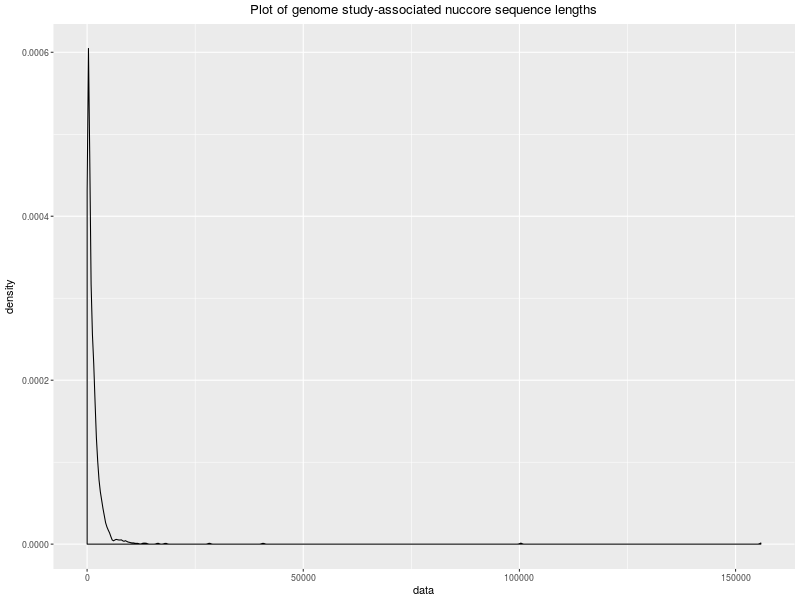

## Statistical summarisation of collated data

The [nuccore.go](nuccore.go) program collates the lengths of sequences in the Entrez nuccore database and sends the results to the public.opencpu.org server to calculate summary statistics and plot a density distribution. Nearly all the computation is performed by the Entrez and opencpu servers instead of by the client program.

```
$ go run nuccore.go -png plot.png -email email@example.com
Summary statistics for genome study-associated nuccore sequence lengths:

    Min.  1st Qu.   Median     Mean  3rd Qu.     Max. 
    11.0    282.0    725.5   1556.6   1713.8 155844.0 

$ eog plot.png
```


